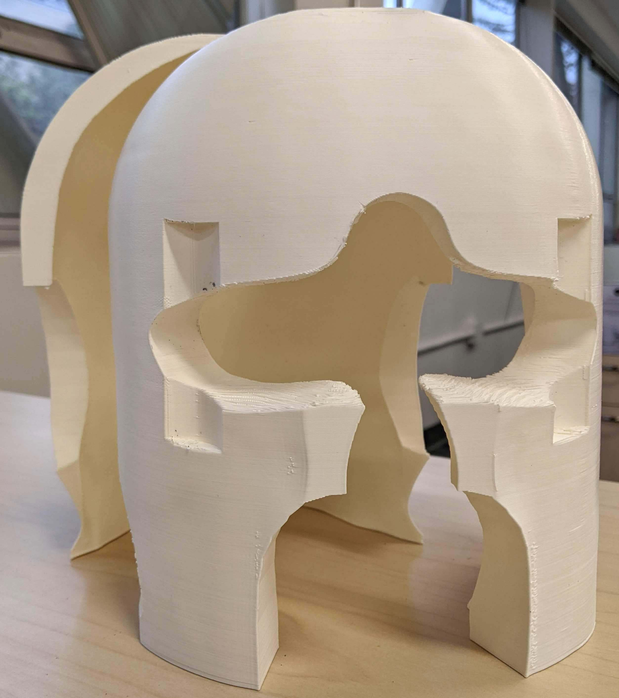

# An automated pipeline to create subject-specific headcases for fMRI scanning


This repository contains an automated pipeline to create subject-specific headcases for fMRI scanning. 

Headcases reduce subject motion (<a href="https://pubmed.ncbi.nlm.nih.gov/30639840/">Power et al., 2019</a>), increase subject's comfort, and facilitate consistent head positioning across multiple scanning sessions. 

The pipeline takes as an input a 3D model of the participant's head and generates STL files of the headcases for 3D printing. This pipeline has been  tested only with a [Structure Sensor](https://structure.io/structure-sensor-pro), but we think other sensors may be used.

Headcases can be generated for the following head coils: Siemens 32ch, Siemens 64ch, and Nova 32ch.

The pipeline is written in Python and uses [MeshLab](https://www.meshlab.net/) and [Blender](https://www.blender.org/). 
<br clear="left">

## Usage

The basic [Structure Scanner iOS app](https://apps.apple.com/us/app/scanner-structure-sdk/id891169722) can be used to scan a 3D model of the participant's head. For recommendations on how to scan the participant's head, see [this document](docs/glab_headcase_pipeline.md). From the Scanner app, the 3D model file (`Model.zip`) will need to be sent to an email address.

The pipeline can then be used to generate a headcase with

```bash
python make_headcase.py Model.zip Headcase.zip --headcoil s32
```

Several options are available, including whether the headcase should be split in two parts (front and back) or in four parts (front-top, front-bottom, back-top, back-bottom). Four parts (the default) can be printed more easily on most 3D printers, but they might require gluing together the top and bottom parts. To see all options, run

```bash
python make_headcases.py --help
```

## Running with Docker

We recommend running the pipeline with the Dockerfile provided in this repository.

First, the docker image needs to be built.

```bash
docker build --tag caseforge .
```

Then, the pipeline can be run with

```bash
docker run --rm caseforge:latest --help
```

To let docker see the folder containing the head 3D model, you will have to bind the folder inside the container. For example, if the head model is in `/tmp/test-headcase/model.zip`, the following command should be run

```bash
docker run -v /tmp:/tmp --rm caseforge:latest /tmp/test-headcase/model.zip /tmp/test-headcase/case.zip
```

## Manual installation

Python requirements are listed under `requirements.txt`, and can be installed with

```bash
pip install -r requirements.txt
```

We also provide a conda environment file. The environment was created on Ubuntu, so it might not work on other operating systems. 
The environment can be installed with 

```bash
conda env create -f conda-environment.yml --name headcase
```

The pipeline also requires

- Blender 2.7.9 (**Do not use newer versions of Blender, or the pipeline won't work.**)
- MeshLab 1.3.2 (**The pipeline has been tested only with this version.**)
