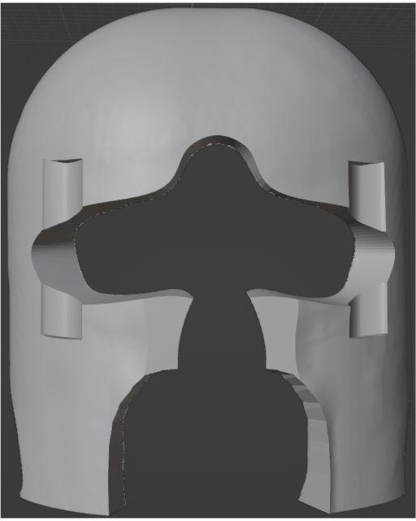
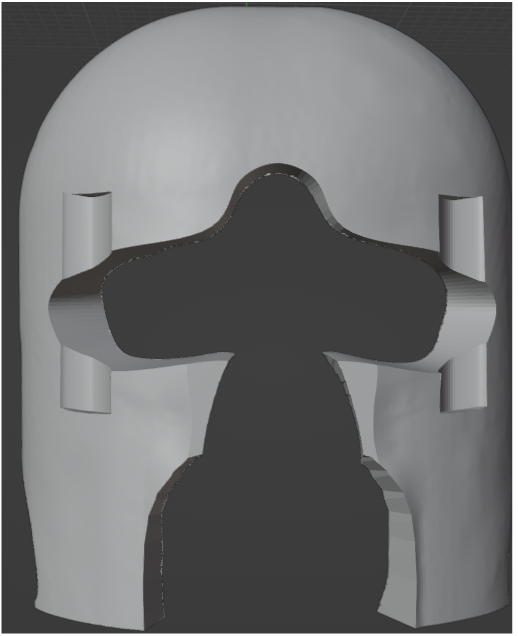
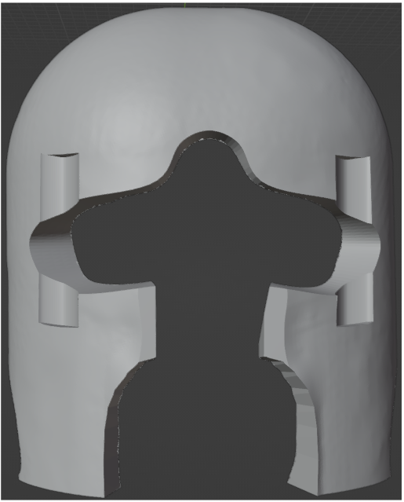
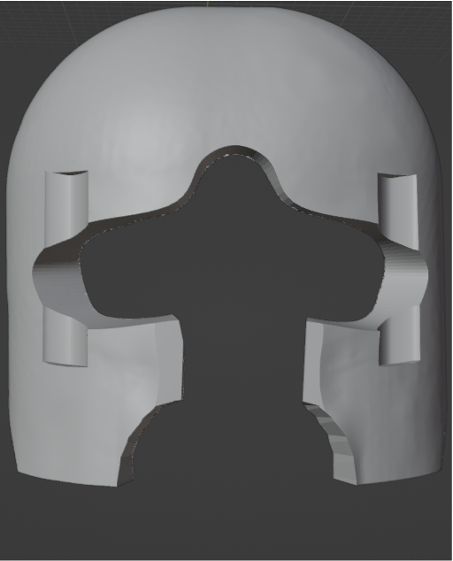

# Headcase customizations

Several customizations files are provided in the `stls` directory. These files are used
to remove extra material from the headcases after the head model has been carved out.
The shapes contained in the customization file will be removed from the headcase.
If you have issues with the fit of the headcase, or if you want to further customize the
headcases, you can generate a similar customization file and pass it to the pipeline
with the argument `--customizations-file`.

## Available customizations

There are four customizations currently available.

- `default_customizations_v1.stl`. This is the original file used by CaseForge. With 
3D printed headcases, it may feel slightly too tight on the nose.
- `default_customizations_v2.stl`. A modified version with slightly more space around
the nose.
- `default_customizations_v3.stl`. A modified version with even more space around the 
nose and cheeks.
- `default_customizations_v4.stl`. Similar to the previous version, but with the bottom
part of the front headcase removed to provide more comfort for some participants.

### `default_customizations_v1.stl`

### `default_customizations_v2.stl`

### `default_customizations_v3.stl`

### `default_customizations_v4.stl`

