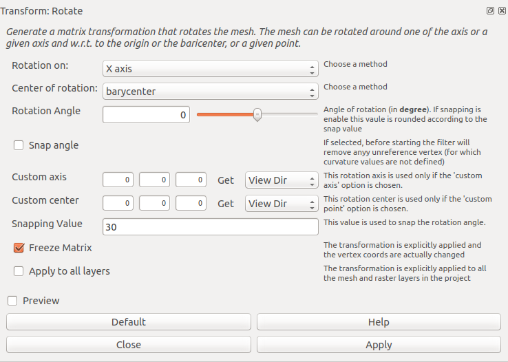
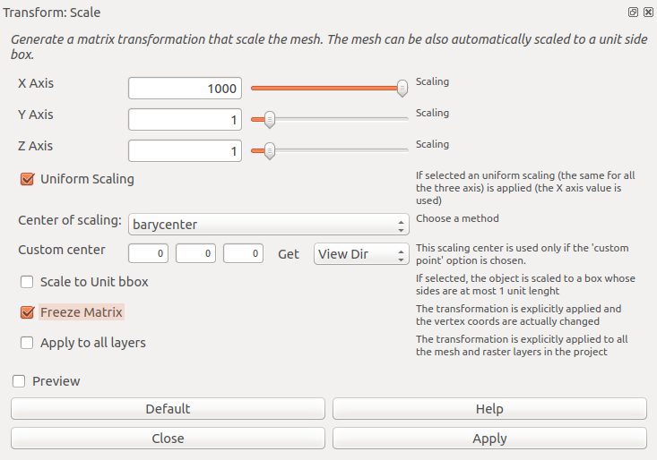
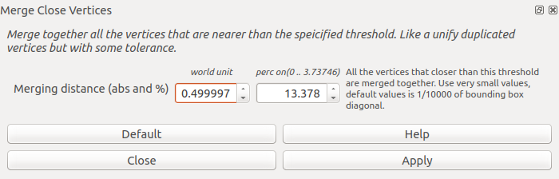
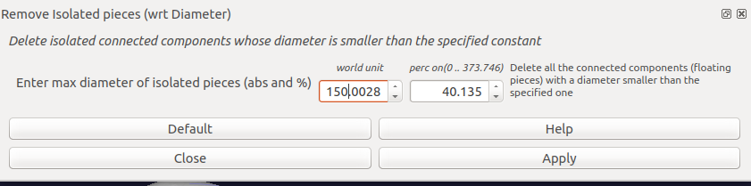
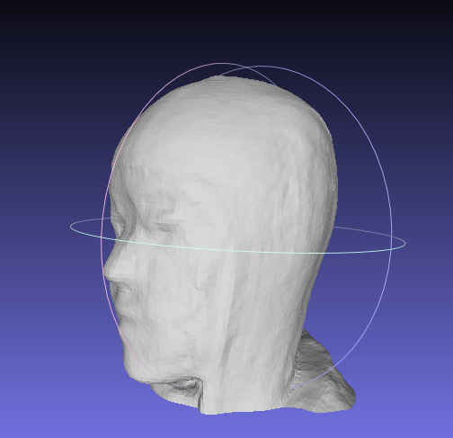
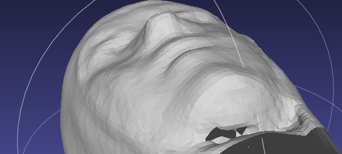
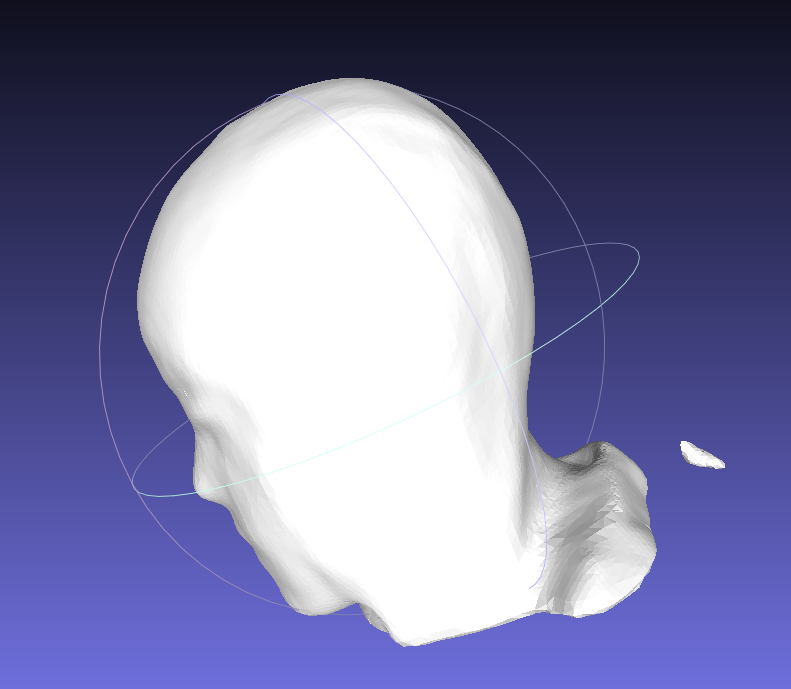

## Stepwise model clean implemented in meshlab

1. Transform: Move, Translate, and center

	

* Major observable shift

	

* [meshlab function translate2](https://github.com/3DLIRIOUS/MeshLabXML/blob/ba2c13ba7cd785b94add9b95bf33414c7099be70/meshlabxml/transform.py#L11)

2. Transform: Rotate

	

* (LG tested no rotated was implemented, as value is set to 0)

* [meshlab function rotate2](https://github.com/3DLIRIOUS/MeshLabXML/blob/ba2c13ba7cd785b94add9b95bf33414c7099be70/meshlabxml/transform.py#L85)

3. Transform: Scale

	

* (LG tested 1000 should be the same as 1: meaning no scaling was implemented)

* [meshlab function scale2](https://github.com/3DLIRIOUS/MeshLabXML/blob/ba2c13ba7cd785b94add9b95bf33414c7099be70/meshlabxml/transform.py#L223)

4. Merge Close Vertex

	

* Not much observable changes

* [meshlab function merge_vert](https://github.com/3DLIRIOUS/MeshLabXML/blob/ba2c13ba7cd785b94add9b95bf33414c7099be70/meshlabxml/clean.py#L8)

5. Remove Isolated Pieces

	

* observable changes: isolated pieces are removed

	  

6. Close holes: (aka. Remove Faces from Non Manifold Edges)

	

* Observable changes: holes are filled
	
	  

* [meshlab function close_holes](https://github.com/3DLIRIOUS/MeshLabXML/blob/ba2c13ba7cd785b94add9b95bf33414c7099be70/meshlabxml/clean.py#L40)

7. Surface Reconstruction using Poisson

	

* Observable changes: smoother surface (but not sure why some isolated pieces come back?)

	

* [meshlab function surface_poisson](https://github.com/3DLIRIOUS/MeshLabXML/blob/ba2c13ba7cd785b94add9b95bf33414c7099be70/meshlabxml/remesh.py#L294)

8. Vertex Attribute Transfer 

	

* [meshlab function vert_attr_2_meshes](https://github.com/3DLIRIOUS/MeshLabXML/blob/ba2c13ba7cd785b94add9b95bf33414c7099be70/meshlabxml/transfer.py#L120)
